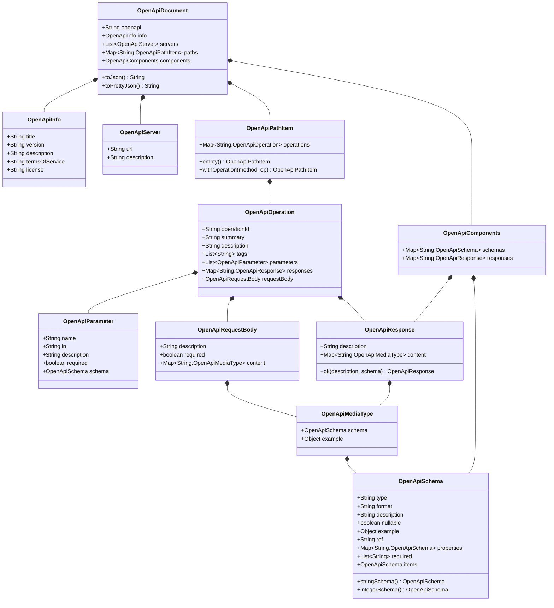

# ether-http-openapi

OpenAPI 3.1 document model, fluent builder, and JSON rendering for the Ether framework. Describe your HTTP API as code and serve the resulting document at `/openapi.json`.

## Maven Dependency

```xml
<dependency>
    <groupId>dev.rafex.ether.http</groupId>
    <artifactId>ether-http-openapi</artifactId>
    <version>8.0.0-SNAPSHOT</version>
</dependency>
```

## Overview

`ether-http-openapi` provides the vocabulary needed to describe an OpenAPI 3.1 document programmatically. Every type is an immutable Java 21 record. An `OpenApiDocumentBuilder` assembles them into an `OpenApiDocument`, which can be serialised to JSON using `ether-json`.

The module is intentionally narrow in scope: it covers description and rendering, not annotation scanning or code generation. You build the document by hand (or via a higher-level helper) and serve it as a JSON endpoint.

---

## Document Structure



---

## API Reference

### `OpenApiDocument`

The root of the document. Built via `OpenApiDocumentBuilder`.

```java
public record OpenApiDocument(
    String openapi,
    OpenApiInfo info,
    List<OpenApiServer> servers,
    Map<String, OpenApiPathItem> paths,
    OpenApiComponents components
) { ... }
```

`toJson()` produces compact JSON; `toPrettyJson()` produces human-readable JSON.

### `OpenApiInfo`

```java
public record OpenApiInfo(
    String title, String version, String description,
    String termsOfService, String license
) { }
```

### `OpenApiServer`

```java
public record OpenApiServer(String url, String description) { }
```

### `OpenApiPathItem`

A path entry keyed by its URL pattern (e.g. `/users/{id}`). `withOperation(method, operation)` returns a new immutable copy with the operation added.

### `OpenApiOperation`

One HTTP method on a path. Carries parameters, request body, and response definitions.

```java
public record OpenApiOperation(
    String operationId, String summary, String description,
    List<String> tags,
    List<OpenApiParameter> parameters,
    Map<String, OpenApiResponse> responses,
    OpenApiRequestBody requestBody
) { ... }
```

### `OpenApiParameter`

Path, query, or header parameter.

```java
public record OpenApiParameter(
    String name, String in,       // "path", "query", "header", "cookie"
    String description, boolean required,
    OpenApiSchema schema
) { }
```

### `OpenApiSchema`

JSON Schema definition for a type. `ref` is a `$ref` string for component references (e.g. `"#/components/schemas/User"`). `stringSchema()` and `integerSchema()` are convenience factories.

### `OpenApiResponse`

```java
public record OpenApiResponse(String description, Map<String, OpenApiMediaType> content) { }
// Convenience factory:
OpenApiResponse.ok(description, schema);
```

### `OpenApiDocumentBuilder`

Fluent builder. `addOperation(path, method, operation)` accumulates operations onto path items.

---

## Examples

### 1. Build a simple OpenAPI document for a User CRUD API

```java
import dev.rafex.ether.http.openapi.builder.OpenApiDocumentBuilder;
import dev.rafex.ether.http.openapi.model.*;
import java.util.List;
import java.util.Map;

var doc = OpenApiDocumentBuilder.create()
    .info(new OpenApiInfo(
        "Users API",
        "1.0.0",
        "Manage user accounts",
        null,
        "MIT"
    ))
    .addServer(new OpenApiServer("https://api.example.com", "Production"))
    .addServer(new OpenApiServer("http://localhost:8080",   "Local development"))
    .addOperation("/users", "get",
        new OpenApiOperation(
            "listUsers",
            "List all users",
            "Returns a paginated list of users.",
            List.of("users"),
            List.of(
                new OpenApiParameter("limit",  "query", "Maximum results", false, OpenApiSchema.integerSchema()),
                new OpenApiParameter("offset", "query", "Skip N results",  false, OpenApiSchema.integerSchema())
            ),
            Map.of("200", OpenApiResponse.ok("Successful response",
                new OpenApiSchema("array", null, null, false, null,
                    null, Map.of(), List.of(),
                    new OpenApiSchema("object", null, null, false, null,
                        "#/components/schemas/User", Map.of(), List.of(), null)))),
            null
        )
    )
    .addOperation("/users", "post",
        new OpenApiOperation(
            "createUser",
            "Create a user",
            null,
            List.of("users"),
            List.of(),
            Map.of(
                "201", OpenApiResponse.ok("User created", new OpenApiSchema(
                    "object", null, null, false, null,
                    "#/components/schemas/User", Map.of(), List.of(), null)),
                "422", OpenApiResponse.ok("Validation error", new OpenApiSchema(
                    "object", null, null, false, null,
                    "#/components/schemas/ProblemDetails", Map.of(), List.of(), null))
            ),
            new OpenApiRequestBody("New user payload", true,
                Map.of("application/json", new OpenApiMediaType(
                    new OpenApiSchema("object", null, null, false, null,
                        "#/components/schemas/CreateUserRequest", Map.of(), List.of(), null),
                    null)))
        )
    )
    .build();

System.out.println(doc.toPrettyJson());
```

---

### 2. Define a path with path parameters and responses

```java
import dev.rafex.ether.http.openapi.builder.OpenApiDocumentBuilder;
import dev.rafex.ether.http.openapi.model.*;
import java.util.List;
import java.util.Map;

// Path: /users/{id}  — GET, PUT, DELETE

// Path parameter shared across operations:
var idParam = new OpenApiParameter("id", "path", "User identifier", true, OpenApiSchema.stringSchema());

// GET /users/{id}
var getOp = new OpenApiOperation(
    "getUser",
    "Get a user by ID",
    null,
    List.of("users"),
    List.of(idParam),
    Map.of(
        "200", OpenApiResponse.ok("User found",
            new OpenApiSchema("object", null, null, false, null,
                "#/components/schemas/User", Map.of(), List.of(), null)),
        "404", OpenApiResponse.ok("User not found",
            new OpenApiSchema("object", null, null, false, null,
                "#/components/schemas/ProblemDetails", Map.of(), List.of(), null))
    ),
    null
);

// PUT /users/{id}
var updateOp = new OpenApiOperation(
    "updateUser",
    "Replace a user record",
    null,
    List.of("users"),
    List.of(idParam),
    Map.of(
        "200", OpenApiResponse.ok("Updated user",
            new OpenApiSchema("object", null, null, false, null,
                "#/components/schemas/User", Map.of(), List.of(), null)),
        "404", OpenApiResponse.ok("User not found",
            new OpenApiSchema("object", null, null, false, null,
                "#/components/schemas/ProblemDetails", Map.of(), List.of(), null))
    ),
    new OpenApiRequestBody("Updated user payload", true,
        Map.of("application/json", new OpenApiMediaType(
            new OpenApiSchema("object", null, null, false, null,
                "#/components/schemas/UpdateUserRequest", Map.of(), List.of(), null),
            null)))
);

// DELETE /users/{id}
var deleteOp = new OpenApiOperation(
    "deleteUser",
    "Delete a user",
    null,
    List.of("users"),
    List.of(idParam),
    Map.of(
        "204", new OpenApiResponse("User deleted successfully", Map.of()),
        "404", OpenApiResponse.ok("User not found",
            new OpenApiSchema("object", null, null, false, null,
                "#/components/schemas/ProblemDetails", Map.of(), List.of(), null))
    ),
    null
);

var doc = OpenApiDocumentBuilder.create()
    .info(new OpenApiInfo("Users API", "1.0.0", null, null, null))
    .addOperation("/users/{id}", "get",    getOp)
    .addOperation("/users/{id}", "put",    updateOp)
    .addOperation("/users/{id}", "delete", deleteOp)
    .build();
```

---

### 3. Define schemas for User and CreateUserRequest DTOs

```java
import dev.rafex.ether.http.openapi.builder.OpenApiDocumentBuilder;
import dev.rafex.ether.http.openapi.model.*;
import java.util.List;
import java.util.Map;

// Java 21 record used in the application:
record User(String id, String name, String email, String role, boolean active) {}
record CreateUserRequest(String name, String email, String password) {}

// Corresponding OpenAPI schemas:
var userSchema = new OpenApiSchema(
    "object",
    null,
    "A registered user account",
    false,
    null,
    null, // not a $ref — this is an inline definition
    Map.of(
        "id",     OpenApiSchema.stringSchema(),
        "name",   OpenApiSchema.stringSchema(),
        "email",  new OpenApiSchema("string", "email", "Email address", false, null, null, Map.of(), List.of(), null),
        "role",   new OpenApiSchema("string", null, "User role", false, "USER", null, Map.of(), List.of(), null),
        "active", new OpenApiSchema("boolean", null, "Account active flag", false, true, null, Map.of(), List.of(), null)
    ),
    List.of("id", "name", "email"), // required fields
    null
);

var createUserSchema = new OpenApiSchema(
    "object",
    null,
    "Payload for creating a new user",
    false,
    null,
    null,
    Map.of(
        "name",     OpenApiSchema.stringSchema(),
        "email",    new OpenApiSchema("string", "email", null, false, null, null, Map.of(), List.of(), null),
        "password", new OpenApiSchema("string", "password", "Min 12 characters", false, null, null, Map.of(), List.of(), null)
    ),
    List.of("name", "email", "password"),
    null
);

// Register schemas in the Components section:
var doc = OpenApiDocumentBuilder.create()
    .info(new OpenApiInfo("Users API", "1.0.0", null, null, null))
    .addSchema("User", userSchema)
    .addSchema("CreateUserRequest", createUserSchema)
    .build();

// Components are now accessible at:
// #/components/schemas/User
// #/components/schemas/CreateUserRequest
System.out.println(doc.components().schemas().containsKey("User")); // true
```

---

### 4. Expose the spec as JSON via an `HttpHandler`

```java
import dev.rafex.ether.http.core.HttpExchange;
import dev.rafex.ether.http.core.HttpHandler;
import dev.rafex.ether.http.openapi.builder.OpenApiDocumentBuilder;
import dev.rafex.ether.http.openapi.model.*;
import java.util.List;
import java.util.Map;

public final class OpenApiHandler implements HttpHandler {

    // Build the document once at startup and cache it as a pre-rendered JSON string.
    private final String specJson;

    public OpenApiHandler() {
        this.specJson = buildDocument().toPrettyJson();
    }

    @Override
    public boolean handle(HttpExchange exchange) {
        // Respond with the pre-rendered JSON.
        // The transport adapter will set Content-Type: application/json.
        exchange.json(200, specJson);
        return true;
    }

    private static OpenApiDocumentBuilder.OpenApiDocument buildDocument() {
        return OpenApiDocumentBuilder.create()
            .info(new OpenApiInfo(
                "My Service API",
                "1.0.0",
                "REST API for My Service",
                null,
                "MIT"
            ))
            .addServer(new OpenApiServer("https://api.example.com", "Production"))
            .addServer(new OpenApiServer("http://localhost:8080",   "Local"))
            .addOperation("/health", "get",
                new OpenApiOperation(
                    "healthCheck",
                    "Health check",
                    "Returns the service health status.",
                    List.of("infrastructure"),
                    List.of(),
                    Map.of("200", OpenApiResponse.ok("Healthy",
                        new OpenApiSchema("object", null, null, false,
                            Map.of("status", "UP"), null,
                            Map.of("status", OpenApiSchema.stringSchema()),
                            List.of("status"), null))),
                    null
                )
            )
            .addOperation("/users", "get",
                OpenApiOperation.of("listUsers", "List users")
            )
            .addOperation("/users/{id}", "get",
                new OpenApiOperation(
                    "getUser", "Get user by ID", null,
                    List.of("users"),
                    List.of(new OpenApiParameter("id", "path", "User ID", true,
                        OpenApiSchema.stringSchema())),
                    Map.of(
                        "200", OpenApiResponse.ok("User", new OpenApiSchema(
                            "object", null, null, false, null,
                            "#/components/schemas/User", Map.of(), List.of(), null)),
                        "404", OpenApiResponse.ok("Not found", new OpenApiSchema(
                            "object", null, null, false, null,
                            "#/components/schemas/ProblemDetails", Map.of(), List.of(), null))
                    ),
                    null
                )
            )
            .build();
    }
}

// Register the handler with your router:
// Route.of("/openapi.json", Set.of("GET"))  →  new OpenApiHandler()
```

The handler pre-renders the document at construction time so that every subsequent request returns the cached string without re-serialising. For dynamic documents (versioned per tenant, etc.) build and serialise inside `handle()` instead.

---

### 5. Composing reusable response and schema definitions

Registering common schemas and responses in `components` avoids repetition across operations and enables `$ref` usage in the rendered JSON.

```java
import dev.rafex.ether.http.openapi.builder.OpenApiDocumentBuilder;
import dev.rafex.ether.http.openapi.model.*;
import java.util.List;
import java.util.Map;

// Common ProblemDetails schema (RFC 9457):
var problemSchema = new OpenApiSchema(
    "object", null, "RFC 9457 Problem Details", false, null, null,
    Map.of(
        "type",     new OpenApiSchema("string", "uri", null, false, null, null, Map.of(), List.of(), null),
        "title",    OpenApiSchema.stringSchema(),
        "status",   OpenApiSchema.integerSchema(),
        "detail",   OpenApiSchema.stringSchema(),
        "instance", new OpenApiSchema("string", "uri", null, true, null, null, Map.of(), List.of(), null)
    ),
    List.of("type", "title", "status"),
    null
);

// Reusable 404 response:
var notFoundResponse = new OpenApiResponse(
    "The requested resource was not found.",
    Map.of("application/problem+json", new OpenApiMediaType(
        new OpenApiSchema("object", null, null, false, null,
            "#/components/schemas/ProblemDetails", Map.of(), List.of(), null),
        null))
);

// Reusable 422 response:
var validationResponse = new OpenApiResponse(
    "The request body failed validation.",
    Map.of("application/problem+json", new OpenApiMediaType(
        new OpenApiSchema("object", null, null, false, null,
            "#/components/schemas/ProblemDetails", Map.of(), List.of(), null),
        null))
);

var doc = OpenApiDocumentBuilder.create()
    .info(new OpenApiInfo("My API", "2.0.0", null, null, null))
    .addSchema("ProblemDetails", problemSchema)
    .addResponse("NotFound",   notFoundResponse)
    .addResponse("Validation", validationResponse)
    .addOperation("/users/{id}", "get",
        new OpenApiOperation(
            "getUser", "Get a user", null,
            List.of("users"),
            List.of(new OpenApiParameter("id", "path", "User ID", true, OpenApiSchema.stringSchema())),
            Map.of(
                "200", OpenApiResponse.ok("User found",
                    new OpenApiSchema("object", null, null, false, null,
                        "#/components/schemas/User", Map.of(), List.of(), null)),
                "404", new OpenApiResponse("Not found",
                    Map.of("application/problem+json", new OpenApiMediaType(
                        new OpenApiSchema("object", null, null, false, null,
                            "#/components/schemas/ProblemDetails", Map.of(), List.of(), null), null)))
            ),
            null
        )
    )
    .build();

// Serialise:
System.out.println(doc.toJson());
```

---

## Design Notes

- **Immutability throughout.** All records are immutable; builder methods return `this` for chaining.
- **`withOperation` is non-destructive.** `OpenApiPathItem.withOperation(method, op)` creates a new path item, preserving all previously added operations on the same path. This is why multiple `addOperation("/users/{id}", ...)` calls accumulate correctly.
- **Method keys are lower-cased.** `withOperation` lower-cases the method string so the JSON output uses `"get"`, `"post"`, etc. as required by the OpenAPI specification.
- **`$ref` is a raw string.** `OpenApiSchema.ref` is serialised as `"$ref": "..."` — the exact pointer string is the caller's responsibility.
- **Rendering via `ether-json`.** `OpenApiDocument.toJson()` delegates to `JsonUtils.toJson(this)`, which uses Jackson under the hood. Any Jackson-compatible JSON customisation applies here.

---

## License

MIT License — Copyright (C) 2025-2026 Raúl Eduardo González Argote
